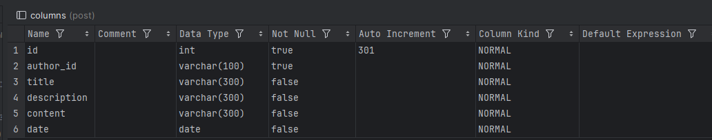
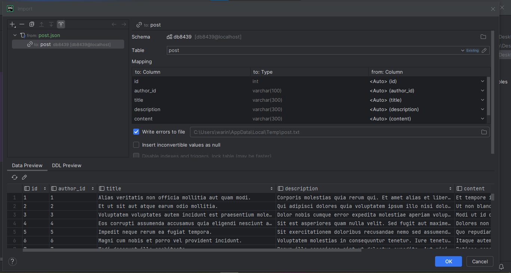
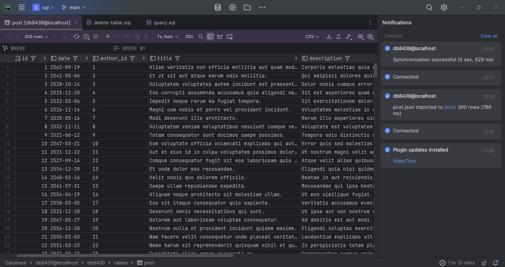
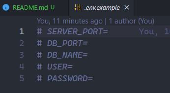
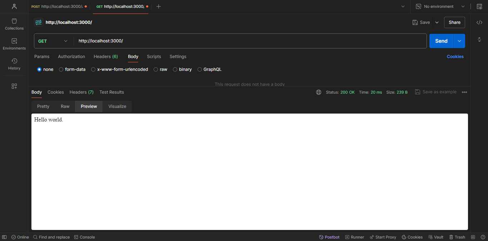
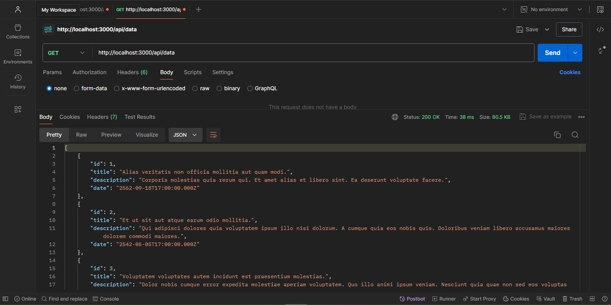

# Express Typescript และ MySQL2
ทดสอบการเชื่อมต่อฐานข้อมูล MySQL โดยใช้ mysql2 library

### ขั้นตอนการติดตั้ง
เปิด Terminal แล้วทำตามขั้นตอนดังนี้

1. clone โปรเจคจาก Github
```
https://github.com/WarinCode/express-ts-and-mysql2.git
```

2. เข้าไปยัง directory ของ project
```
cd express-ts-and-mysql2
```

3. ดาวโหลด์ package library ต่างๆลงโปรเจค
```
npm install
```

4. สร้างฐานข้อมูลและสร้างตารางกำหนดค่า attribute แต่ละ field


5. นำไฟล์ post.json import เข้าไปใน table ที่เราสร้าง 



6. สร้างไฟล์ .env ขึ้นมาใน root directory แล้วกำหนดค่าตัวแปรสภาพแวดล้อมต่างๆโดยในดูตัวอย่างได้ในไฟล์ .env.example


7. run server หลังบ้าน
```
npm run dev
```

8. ทดสอบเส้น API



9. build ตัวโปรเจคจาก Typescript -> Javascript ต้องติดตั้ง Typscript ลงเครื่องก่อน `npm install -g typescript`
```
tsc
```